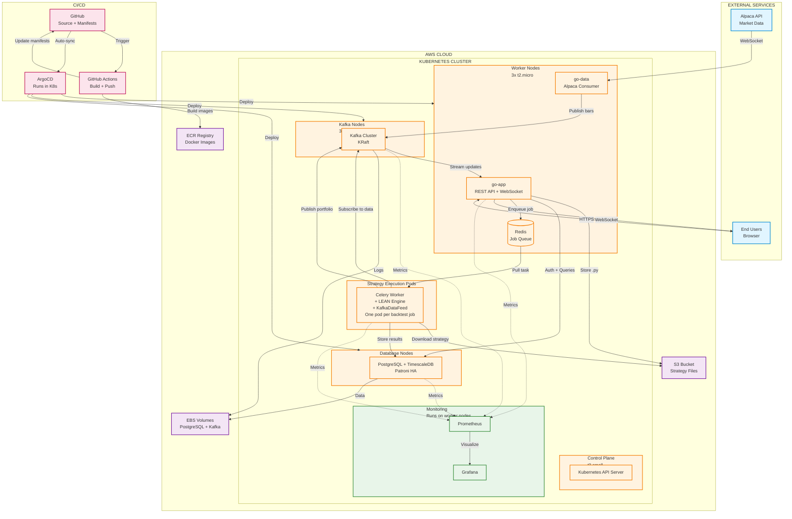
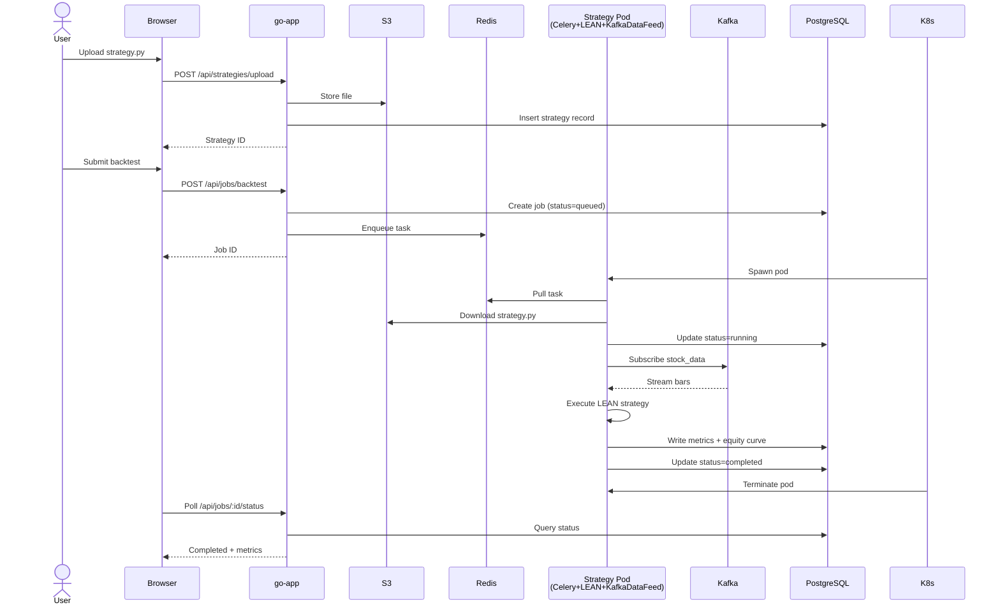
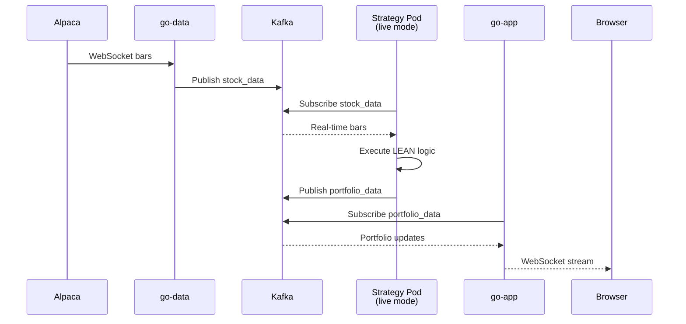
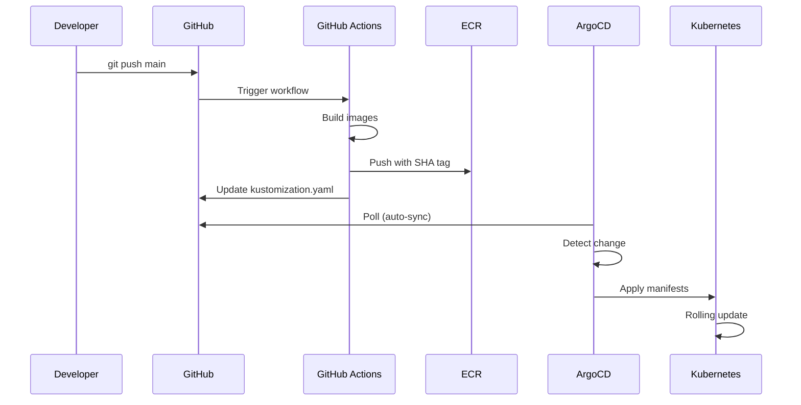

# Architecture

## Overview

Algorithmic trading platform for paper trading and backtesting using QuantConnect LEAN engine. Users upload Python strategies via web UI, submit backtest/live trading jobs, and view comprehensive performance metrics.

## System Architecture Diagram

Resource-based view showing compute nodes and data flow:

## Key Architectural Decisions

### Zookeeper Removal
**Modern Kafka uses KRaft mode** (Kafka Raft consensus protocol), eliminating Zookeeper dependency. Benefits:
- Simpler deployment (one less service)
- Faster metadata operations
- Reduced operational complexity

### Celery + LEAN + KafkaDataFeed as Single Pod
**Strategy execution runs as unified pod**:
- Celery worker pulls job from Redis
- Spawns LEAN engine as subprocess/container
- KafkaDataFeed is a Python class within LEAN process
- All three run together in same pod lifecycle
- Pod terminates after job completes

### Resource Allocation
| Node Type | Count | Instance | Purpose |
|-----------|-------|----------|---------|
| Master | 1 | t3.small | Kubernetes control plane |
| Workers | 3 | t2.micro | API, data ingestion, monitoring |
| Kafka | 3 | t3.small | Dedicated Kafka brokers (tainted nodes) |
| Database | 2 | t3.medium | PostgreSQL HA with Patroni |
| Strategy Pods | Dynamic | Burstable | Spawned per backtest job, auto-scaled |

## Data Flow Scenarios

### 1. Backtest Execution Flow

### 2. Live Trading Flow

### 3. CI/CD Deployment

## Components

### Data Ingestion
- **go-data**: Alpaca WebSocket client, Kafka producer
- **Kafka**: Message broker (KRaft mode, 3 brokers), topics: `stock_data`, `portfolio_data`

### Job Orchestration
- **Redis**: Celery job queue
- **Strategy Pods**: Dynamically spawned, contain Celery + LEAN + KafkaDataFeed

### Strategy Execution
- **LEAN Engine**: QuantConnect backtesting engine
- **KafkaDataFeed**: Python class implementing IDataQueueHandler, subscribes to Kafka
- **Sandboxing**: Block `os`, `subprocess`, `socket`, `eval` imports
- **Limits**: 2 CPU cores, 4GB RAM, 30min timeout (backtests)

### Backend API (Go)
- **go-app**: REST API + WebSocket server
- **Endpoints**:
  - `POST /api/auth/register` - User registration
  - `POST /api/auth/login` - JWT authentication
  - `POST /api/strategies/upload` - Upload .py file to S3
  - `POST /api/jobs/backtest` - Submit backtest job
  - `GET /api/jobs/:id/metrics` - Fetch LEAN results
  - `WS /api/stream/portfolio/:userId` - Real-time portfolio updates

### Database
- **PostgreSQL + TimescaleDB**: Users, strategies, jobs, performance metrics (90+ fields)
- **S3**: Strategy file storage (versioned, encrypted)
- **EBS**: Persistent volumes for PostgreSQL and Kafka

### Frontend
- **React + TypeScript**: Web UI
- **Lightweight Charts**: Interactive equity curves
- **Features**: Auth, strategy upload, backtest config, comprehensive results dashboard

## Infrastructure (Kubernetes on AWS)

### Kops Cluster
- **Region**: us-east-1
- **Network**: Cilium CNI, 172.20.0.0/16 CIDR
- **Nodes**: 1 master + 3 workers + 3 Kafka + 2 database = 9 EC2 instances

### Namespaces
- `atp-core`: go-app, go-data, redis, strategy pods
- `atp-data`: kafka
- `atp-db`: postgresql
- `atp-monitoring`: prometheus, grafana
- `argocd`: ArgoCD

### Secrets Management
- **Sealed Secrets**: Alpaca API keys, JWT secret, PostgreSQL credentials

### Storage
- **PostgreSQL**: EBS gp3, 100GB
- **Kafka**: EBS gp3, 200GB, 7-day retention
- **S3**: Strategy files, backups

## Security

### Authentication
- JWT tokens (HS256, 24hr expiry)
- bcrypt password hashing (cost 12)

### Strategy Sandboxing
- Blocked imports: `os`, `subprocess`, `socket`, `eval`
- Container limits: 2 CPU cores, 4GB RAM
- Execution timeout: 30min (backtests), 24hr (live)

### Network Policies
- Cilium NetworkPolicy: Deny egress by default
- Allow-list: API to PostgreSQL, Workers to Kafka/S3

## Monitoring

### Prometheus Metrics
- Celery: Queue depth, task duration
- API: Request latency (p95), error rate
- Kafka: Partition lag, broker health
- PostgreSQL: Connection count, query duration

### Grafana Dashboards
- System: Node CPU/memory, pod status
- Application: Job throughput, API latency
- Business: Active users, backtests/day

### Logs
- All services log to `/logs` (JSON format)
- Loki aggregates logs from all pods
- Retention: 30 days

### Alerts
- Critical: Database down, Kafka offline, no workers
- Warning: High failure rate, slow API, queue backup
- Destination: Slack

## Cost Estimate (Monthly)

| Resource | Configuration | Cost |
|----------|---------------|------|
| EC2 | 1 master + 3 workers + 3 Kafka + 2 DB | ~$280 |
| EBS | 500GB total | ~$50 |
| S3 | 50GB | ~$2 |
| Data Transfer | 500GB | ~$45 |
| ALB | 1 load balancer | ~$20 |
| **Total** | | **~$397** |
| **Optimized** (spot + reserved) | | **~$290** |
