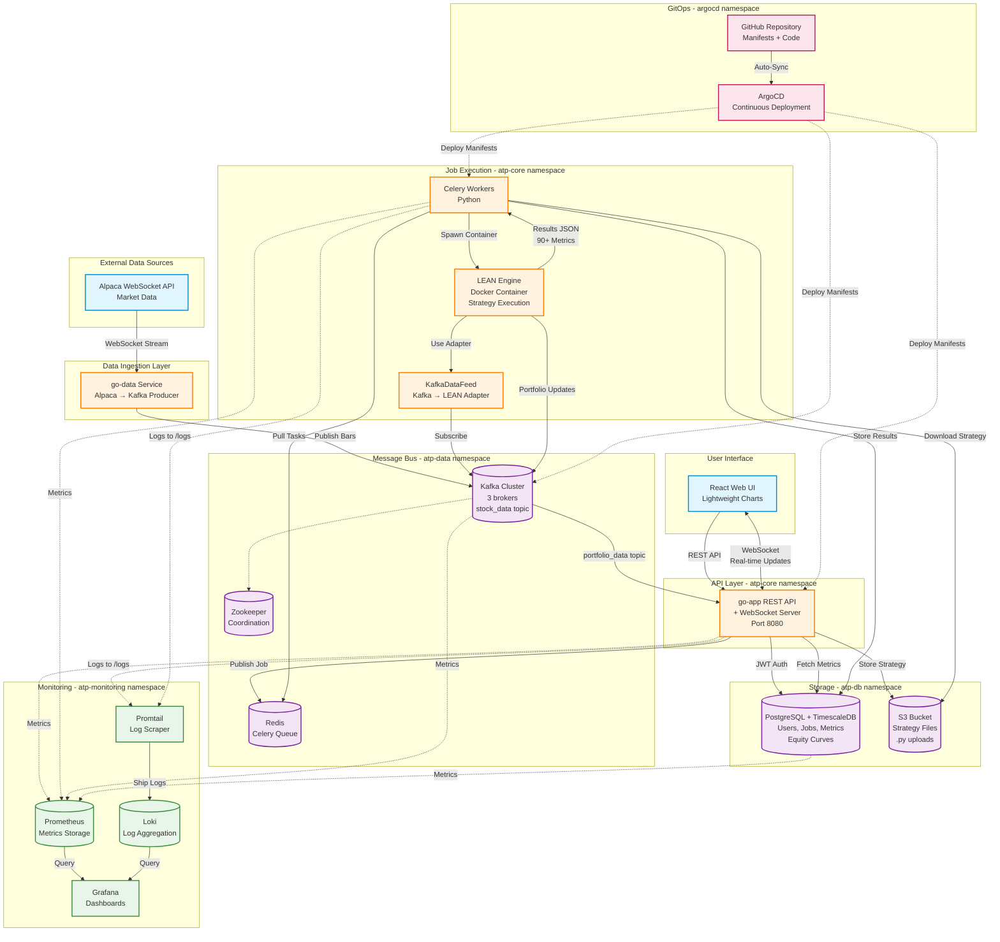
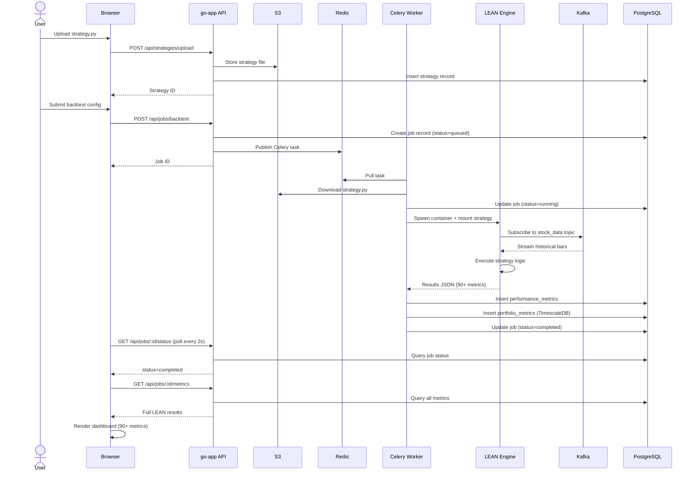
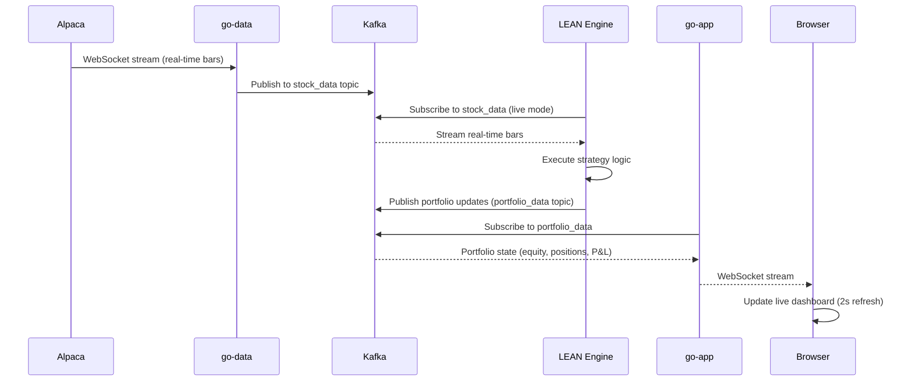
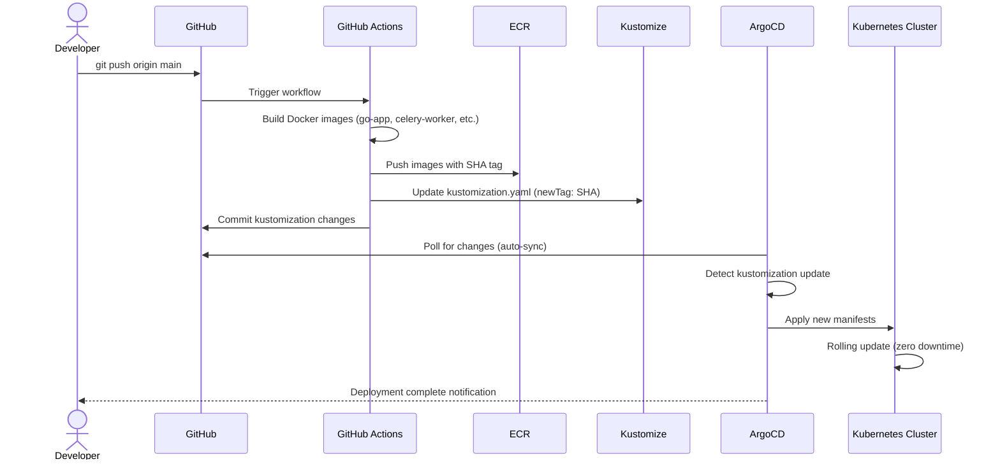

# Architecture

## Overview

Algorithmic trading platform for paper trading and backtesting using QuantConnect LEAN engine. Users upload Python strategies via web UI, submit backtest/live trading jobs, and view comprehensive performance metrics.

## System Architecture Diagram

## Data Flow Scenarios

### 1. Backtest Execution Flow

### 2. Live Trading Flow

### 3. CI/CD Deployment Flow

## Components

### Data Ingestion
- **go-data**: Alpaca WebSocket client → Kafka producer
- **Kafka**: Message broker for real-time bars (topic: `stock_data`)
- **Credentials**: `APCA_API_KEY_ID`, `APCA_API_SECRET_KEY` (Sealed Secrets)

### Job Orchestration
- **Redis**: Celery job queue
- **Celery Workers**: Python workers execute LEAN containers
- **Job Types**: Backtest (historical) or Live (paper trading)

### Strategy Execution
- **LEAN Engine**: QuantConnect backtesting engine in Docker
- **KafkaDataFeed**: Custom adapter (Kafka → LEAN Bar objects)
- **Output**: JSON with 90+ metrics (Sharpe, Sortino, Alpha, Beta, VaR, trade stats, etc.)
- **Sandboxing**: Block `os`, `subprocess`, `socket`, `eval` imports

### Backend API (Go)
- **go-app**: REST API + WebSocket server
- **Endpoints**:
  - `POST /api/auth/register` - User registration
  - `POST /api/auth/login` - JWT authentication
  - `POST /api/strategies/upload` - Upload .py file to S3
  - `POST /api/jobs/backtest` - Submit backtest job
  - `GET /api/jobs/:id/metrics` - Fetch LEAN results
  - `WS /api/stream/portfolio/:userId` - Real-time portfolio updates

### Database
- **PostgreSQL**: Users, strategies, jobs, performance metrics (90+ fields)
- **TimescaleDB**: Equity curve time series (OHLC data)
- **S3**: Strategy file storage (versioned, encrypted)

### Frontend (React)
- **Auth**: Login/register with JWT
- **Strategy Upload**: File upload (.py)
- **Backtest Config**: Form (dates, cash, symbols)
- **Results Dashboard**: Comprehensive metrics display (hero cards, tabs, equity chart)
- **Live Trading**: Real-time WebSocket updates

## Infrastructure (Kubernetes on AWS)

### Kops Cluster
- **Master**: 1x t3.small (control plane)
- **Workers**: 3x t2.micro (API, Celery)
- **Kafka**: 3x t3.small (dedicated nodes, tainted)
- **Database**: 2x t3.medium (PostgreSQL HA with Patroni)
- **Region**: us-east-1
- **Network**: Cilium CNI, 172.20.0.0/16 CIDR

### Namespaces
- `atp-core`: go-app, celery-workers
- `atp-data`: kafka, zookeeper, redis
- `atp-db`: postgresql
- `atp-monitoring`: prometheus, grafana, loki
- `argocd`: ArgoCD (GitOps)

### Secrets Management
- **Sealed Secrets**: Alpaca API keys, JWT secret, PostgreSQL credentials

### Storage
- **PostgreSQL**: EBS gp3, 100GB
- **Kafka**: EBS gp3, 200GB, 7-day retention
- **S3**: Strategy files, backups

## Security

### Authentication
- JWT tokens (HS256, 24hr expiry)
- bcrypt password hashing (cost 12)

### Strategy Sandboxing
- Blocked imports: `os`, `subprocess`, `socket`, `eval`
- Container limits: 2 CPU cores, 4GB RAM
- Execution timeout: 30min (backtests), 24hr (live)

### Network Policies
- Cilium NetworkPolicy: Deny egress by default
- Allow-list: API → PostgreSQL, Workers → Kafka/S3

## Monitoring

### Prometheus Metrics
- Celery: Queue depth, task duration
- API: Request latency (p95), error rate
- Kafka: Partition lag, broker health
- PostgreSQL: Connection count, query duration

### Grafana Dashboards
- System: Node CPU/memory, pod status
- Application: Job throughput, API latency
- Business: Active users, backtests/day

### Loki Logs
- All services log to `/logs` (JSON format)
- Promtail DaemonSet scrapes pod logs
- Retention: 30 days

### Alerts
- Critical: Database down, Kafka offline, no workers
- Warning: High failure rate, slow API, queue backup
- Destination: Slack

## Cost Estimate (Monthly)

| Resource | Configuration | Cost |
|----------|---------------|------|
| EC2 | 1 master + 3 workers + 3 Kafka + 2 DB | ~$280 |
| EBS | 500GB total | ~$50 |
| S3 | 50GB | ~$2 |
| Data Transfer | 500GB | ~$45 |
| ALB | 1 load balancer | ~$20 |
| **Total** | | **~$397** |
| **Optimized** (spot + reserved) | | **~$290** |
